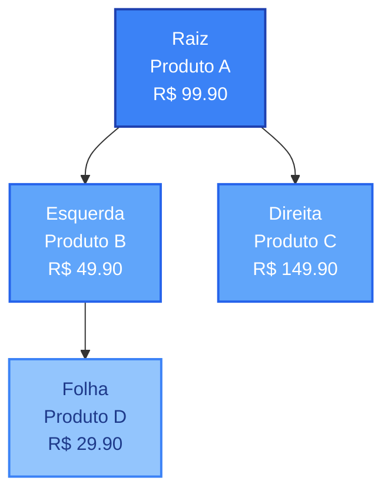

# 🌳 TreeVisualization - Componente de Visualização de Árvore AVL

## 📋 Descrição

Componente React que renderiza diagramas de árvore AVL usando **Mermaid.js**, permitindo visualização interativa da estrutura de dados.

## 🎯 Funcionalidades

- ✅ Renderiza diagramas Mermaid recebidos do backend
- ✅ Tratamento de erros com mensagens amigáveis
- ✅ Estado vazio com mensagem informativa
- ✅ Estilos responsivos com Tailwind CSS
- ✅ Scroll automático para diagramas grandes

## 🔌 Integração com Backend

### Formato esperado do backend (Python/FastAPI)

```python
from fastapi import APIRouter
from backend.tree.avl import generate_mermaid_diagram

router = APIRouter()

@router.get("/tree/visualize")
def visualize_tree():
    """
    Retorna a representação Mermaid da árvore AVL
    """
    mermaid_string = generate_mermaid_diagram()
    return {"mermaid_string": mermaid_string}
```

### Exemplo de string Mermaid retornada:

```python
def generate_mermaid_diagram(root_node) -> str:
    """
    Gera diagrama Mermaid a partir da árvore AVL
    """
    lines = ["graph TD"]
    
    def traverse(node, parent_id=None):
        if not node:
            return
        
        node_id = f"Node{node.id}"
        label = f"{node.product.nome}<br/>R$ {node.product.preco:.2f}"
        lines.append(f'    {node_id}["{label}"]')
        
        if parent_id:
            lines.append(f"    {parent_id} --> {node_id}")
        
        traverse(node.left, node_id)
        traverse(node.right, node_id)
    
    traverse(root_node)
    
    # Adiciona estilos
    lines.append("    style Node* fill:#60a5fa,stroke:#2563eb")
    
    return "\n".join(lines)
```

### Chamada no frontend:

```typescript
import { buscarProdutosAVL } from '../services/api';

// Em um componente ou useEffect
const loadTree = async () => {
  try {
    const mermaidString = await buscarProdutosAVL();
    setTreeString(mermaidString);
  } catch (error) {
    console.error('Erro ao carregar árvore:', error);
  }
};
```

## 🎨 Exemplo de uso no componente

```tsx
import { TreeVisualization } from '../components/TreeVisualization';

function MyPage() {
  const [treeString, setTreeString] = useState<string>('');

  useEffect(() => {
    // Busca do backend
    buscarProdutosAVL().then(setTreeString);
  }, []);

  return <TreeVisualization treeString={treeString} />;
}
```

## 📊 Formato Mermaid AVL Completo



## 🔧 Configuração do Mermaid

O componente já vem pré-configurado com:

```typescript
mermaid.initialize({
  startOnLoad: false,
  theme: 'default',
  securityLevel: 'loose',
  flowchart: {
    useMaxWidth: true,
    htmlLabels: true,
    curve: 'basis'
  }
});
```

## 🐛 Tratamento de erros

O componente exibe mensagens específicas para:

1. **Erro de renderização** - Problema ao processar o Mermaid
2. **Erro de dados** - String inválida ou mal formatada
3. **Estado vazio** - Quando não há dados para visualizar

## 📦 Dependências

- `mermaid` - ^11.12.1
- `react` - ^19.1.1
- `tailwindcss` - ^4.1.16

## 🚀 Próximos passos

Quando o backend estiver pronto:

1. Certifique-se que o endpoint `/tree/visualize` está funcionando
2. Teste a resposta no Postman/Insomnia
3. No `.env`, mude para `VITE_MODE=online`
4. Reinicie o servidor Vite (`npm run dev`)
5. Acesse `/arvore` e veja a mágica acontecer! ✨

## 💡 Dicas

- Use `console.log(treeString)` para debug da string Mermaid
- Teste strings Mermaid no [Mermaid Live Editor](https://mermaid.live)
- Adicione mais estilos personalizados conforme necessário
- Considere adicionar zoom/pan para árvores grandes
